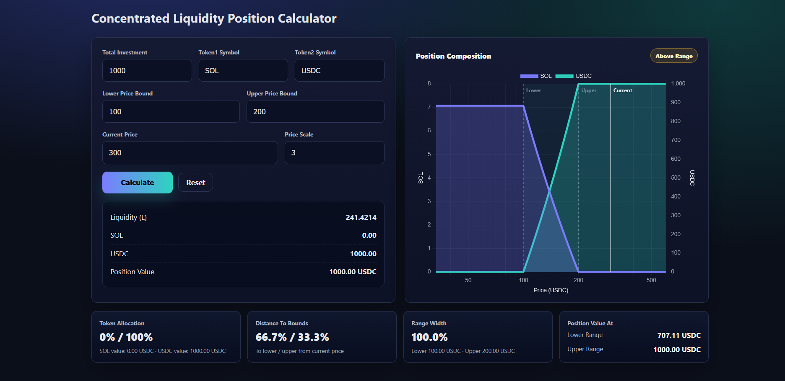
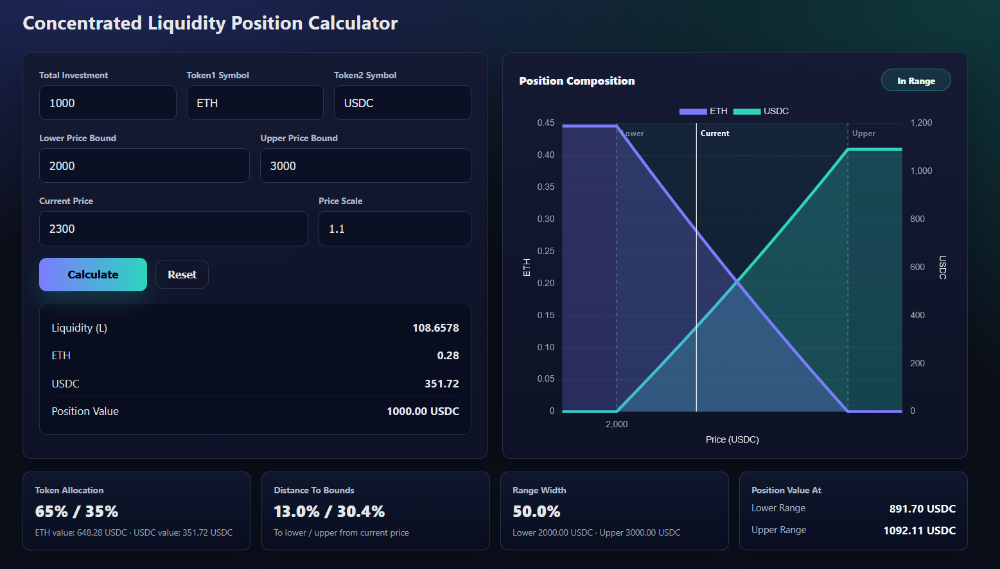

# Concentrated Liquidity Position Calculator

A single-page calculator for visualizing a concentrated liquidity position. Enter a token pair, investment amount, lower range, upper range, and current price to estimate the position's token allocation, value, and range behavior.





## What It Does

- Calculates liquidity for a concentrated liquidity position.
- Shows the current amount of Token1 and Token2 in the position.
- Displays total position value in Token2 terms.
- Visualizes Token1 and Token2 composition across the selected price range.
- Marks the lower range, upper range, and current price on the chart.
- Highlights whether the position is in range, below range, or above range.
- Shows token allocation, distance to bounds, range width, and estimated position value at the lower and upper range.

## How To Use

1. Open `LP_combined_v5.html` in a browser.
2. Enter the total investment amount.
3. Set `Token1 Symbol` and `Token2 Symbol`.
4. Enter the lower price bound, upper price bound, and current price.
5. Adjust `Price Scale` if you want the chart to show more or less price area outside the selected range.
6. Click `Calculate`.

## Inputs

- `Total Investment`: The starting value of the position, denominated in Token2.
- `Token1 Symbol`: The asset being paired against Token2.
- `Token2 Symbol`: The quote asset. Defaults to `USDC`.
- `Lower Price Bound`: The lower end of the concentrated liquidity range.
- `Upper Price Bound`: The upper end of the concentrated liquidity range.
- `Current Price`: The current Token1 price in Token2 terms.
- `Price Scale`: Controls how much extra chart area is shown around the selected range.

## Outputs

- `Liquidity (L)`: Calculated liquidity for the entered position.
- `Token1 Amount`: Current Token1 balance implied by the range and price.
- `Token2 Amount`: Current Token2 balance implied by the range and price.
- `Position Value`: Current total value in Token2.
- `Token Allocation`: Current value split between Token1 and Token2.
- `Distance To Bounds`: Distance from current price to the lower and upper range.
- `Range Width`: Percentage width between lower and upper price bounds.
- `Position Value At`: Estimated position value at the lower and upper range.

## Range Behavior

- Below the lower range, the position is fully in Token1.
- Inside the range, the position holds a mix of Token1 and Token2.
- Above the upper range, the position is fully in Token2.

## Technical Notes

This is a standalone HTML file using vanilla JavaScript and Chart.js from a CDN:

```html
https://cdnjs.cloudflare.com/ajax/libs/Chart.js/3.7.0/chart.min.js
```

Because Chart.js is loaded from a CDN, the chart requires an internet connection unless the dependency is bundled locally.

## Third-Party Libraries

This project uses Chart.js, which is licensed under the MIT License. Chart.js copyright belongs to the Chart.js contributors.

## Disclaimer

This calculator is for educational and estimation purposes only. It does not account for fees, slippage, impermanent loss, gas costs, or protocol-specific implementation details.
